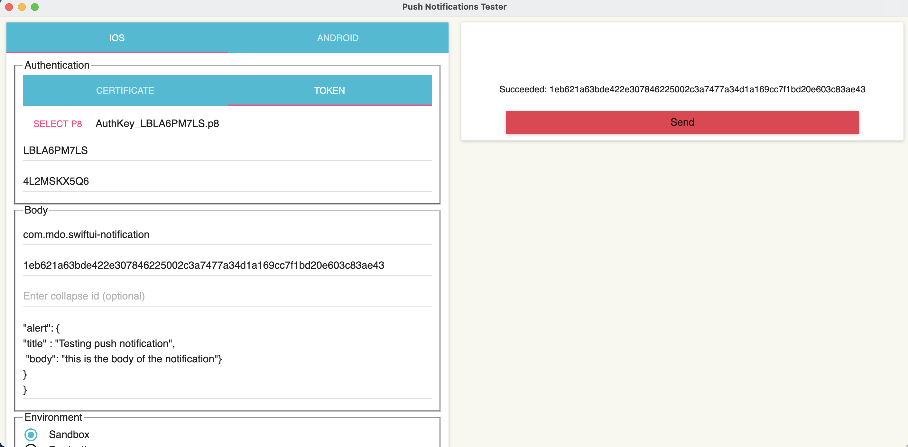

# swiftui-notification
sample app for both remote and local notification 

### Note: Push Notifications should be added in Sigining & Capabilities section of the project. 

creating the following app delegate class for preparing the app to recieve push notification:
```swift
import UIKit
import UserNotifications

class AppDelegate: NSObject, UIApplicationDelegate {
  // 1
  func application(
    _ application: UIApplication,
    didFinishLaunchingWithOptions launchOptions:
    [UIApplication.LaunchOptionsKey: Any]?
  ) -> Bool {
    // 2
    Task {
      let center = UNUserNotificationCenter.current()
      try await center.requestAuthorization(options: [.badge, .sound, .alert])

      // 3
      await MainActor.run {
        application.registerForRemoteNotifications()
      }
    }

    return true
  }
}
```
      
Since SwiftUI lifecycle apps no longer call the app delegate by default, we’ll need to tell SwiftUI to use the app delegate you just created:
we add these line to swiftui_notification.swift file:
```swift
@UIApplicationDelegateAdaptor(AppDelegate.self)
private var appDelegate
```      
obtaining the device token as a result of successful registration for remote notification:
```swift
func application(
        _ application: UIApplication,
        didRegisterForRemoteNotificationsWithDeviceToken deviceToken: Data) {
        let token = deviceToken.reduce("") { $0 + String(format: "%02x", $1) }
        print(token)
 }
```  
in case the process of registering the device for remote notification we can trigger the error with the following function:
```swift
func application(
  _ application: UIApplication,
  didFailToRegisterForRemoteNotificationsWithError error: Error) {
  print(error)
}
 ```     
  ### Note: Authentication token is needed in order to establish a secure connection between the backend and the ios app

 

After creating an auhtentication token via Member center of apple developer dashboard we need to use the auhtentication token in order to send a notification.

MacOS app folder has an open source mac-os application that allows us to push notification by providing authentication key, key ID, team ID and payload as illustrated in the image below:

 


if you have your own backend server implementation some structs and functions would be helpful for the ios app. add TokenDetails struct which is responsible for decoding the token Id that will be sent to your backend server:

```swift
 import Foundation

struct TokenDetails {
  private let encoder = JSONEncoder()

  let token: String
  let debug: Bool

  init(token: Data) {
    self.token = token.reduce("") { $0 + String(format: "%02x", $1) }

    #if DEBUG
      encoder.outputFormatting = .prettyPrinted
      debug = true
      print(String(describing: self))
    #else
      debug = false
    #endif
  }

  func encoded() -> Data {
    // swiftlint:disable force_try
    return try! encoder.encode(self)
  }
}
 ```

then we can refactor our existing code by creating a seprate enum for PushNotifications which encapsulates both requesting authorization and registration for remote notification:

```swift
import UIKit
import UserNotifications

enum PushNotifications {
  static func send(token: Data, to url: String) {
    guard let url = URL(string: url) else {
      fatalError("Invalid URL string")
    }

    Task {
      let details = TokenDetails(token: token)

      var request = URLRequest(url: url)
      request.addValue("application/json", forHTTPHeaderField: "Content-Type")
      request.httpMethod = "POST"
      request.httpBody = details.encoded()

      _ = try await URLSession.shared.data(for: request)
    }
  }

  static func register(in application: UIApplication) {
    Task {
      let center = UNUserNotificationCenter.current()

      try await center.requestAuthorization(options: [.badge, .sound, .alert])

      await MainActor.run {
        application.registerForRemoteNotifications()
      }
    }
  }
}
```

therefore, AppDelegate.swift will be as following:

```swift
import UIKit
import UserNotifications

class AppDelegate: NSObject, UIApplicationDelegate {
  func application(_ application: UIApplication, didFinishLaunchingWithOptions launchOptions: [UIApplication.LaunchOptionsKey: Any]?) -> Bool {
    PushNotifications.register(in: application)
    return true
  }

  func application(_ application: UIApplication, didRegisterForRemoteNotificationsWithDeviceToken deviceToken: Data) {
    PushNotifications.send(token: deviceToken, to: "http://192.168.1.1:8080/token")
  }
}
 ```
