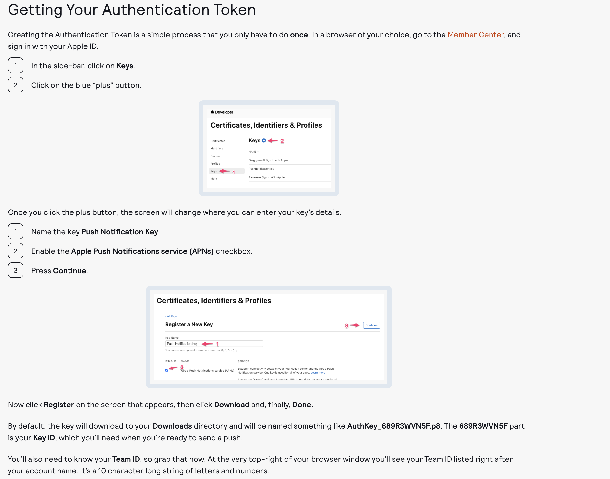

# swiftui-notification
sample app for both remote and local notification 

### Note: Push Notifications should be added in Sigining & Capabilities section of the project. 

creating the following app delegate class for preparing the app to recieve push notification:
```swift
import UIKit
import UserNotifications

class AppDelegate: NSObject, UIApplicationDelegate {
  // 1
  func application(
    _ application: UIApplication,
    didFinishLaunchingWithOptions launchOptions:
    [UIApplication.LaunchOptionsKey: Any]?
  ) -> Bool {
    // 2
    Task {
      let center = UNUserNotificationCenter.current()
      try await center.requestAuthorization(options: [.badge, .sound, .alert])

      // 3
      await MainActor.run {
        application.registerForRemoteNotifications()
      }
    }

    return true
  }
}
```
      
Since SwiftUI lifecycle apps no longer call the app delegate by default, we’ll need to tell SwiftUI to use the app delegate you just created:
we add these line to swiftui_notification.swift file:
```swift
@UIApplicationDelegateAdaptor(AppDelegate.self)
private var appDelegate
```      
obtaining the device token as a result of successful registration for remote notification:
```swift
func application(
        _ application: UIApplication,
        didRegisterForRemoteNotificationsWithDeviceToken deviceToken: Data) {
        let token = deviceToken.reduce("") { $0 + String(format: "%02x", $1) }
        print(token)
 }
```  
in case the process of registering the device for remote notification we can trigger the error with the following function:
```swift
func application(
  _ application: UIApplication,
  didFailToRegisterForRemoteNotificationsWithError error: Error) {
  print(error)
}
 ```     
  ### Note: Authentication token is needed in order to establish a secure connection between the backend and the ios app

 

After creating an auhtentication token via Member center of apple developer dashboard we need to use the auhtentication token in order to send a notification.
